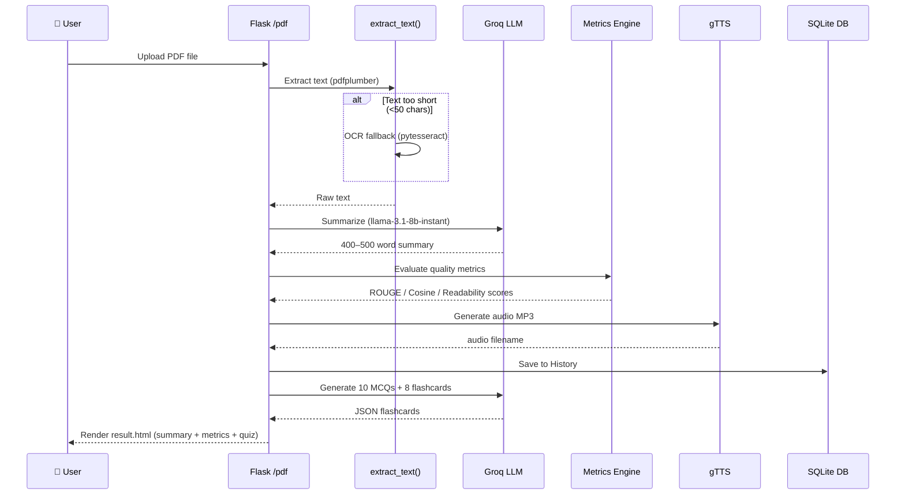
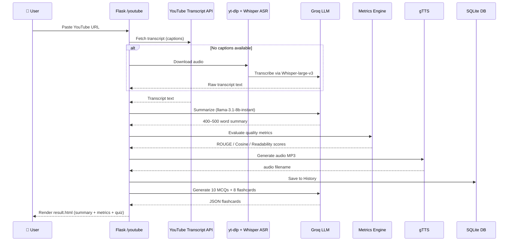

# 📚 ExplainIT AI

> AI-powered educational summarization platform — instantly summarize PDFs and YouTube videos, generate quizzes, and study with smart flashcards.


---

## ✨ Features

| Feature | Description |
|---|---|
| 📄 **PDF Summarization** | Upload any PDF (text or scanned) and get a clear 400–500 word summary |
| 🎬 **YouTube Summarization** | Paste a YouTube URL — transcripts fetched automatically or via Whisper ASR |
| 🔊 **Text-to-Speech** | Summaries converted to audio (MP3) using gTTS — works on Mac, Linux & Windows |
| 🧠 **MCQ Quiz** | Auto-generate 10 multiple-choice questions from any summary |
| 🃏 **Study Flashcards** | 8 flippable Q&A flashcards with a 3D flip animation |
| 📊 **Quality Metrics** | ROUGE-1/2/L, Cosine Similarity, Readability (Flesch), Entity Preservation, Overall Score |
| 🗓️ **Dashboard** | Per-user history, dynamic calendar widget, and a localStorage To-Do list |
| 🔐 **Auth** | User registration & login with hashed passwords (Werkzeug) |

---

## 🏗️ High-Level Design

### System Architecture

```mermaid
graph TB
    subgraph Client["🌐 Browser (Client)"]
        UI["HTML / Bootstrap UI"]
        JS["Vanilla JS\n(history, calendar, flashcards)"]
    end

    subgraph Flask["🐍 Flask Backend (main.py)"]
        Auth["Auth Layer\n/login  /register  /successful"]
        PDF["PDF Pipeline\n/pdf"]
        YT["YouTube Pipeline\n/youtube"]
        FC["Flashcard Engine\n/generate_flashcards\n/generate_study_flashcards\n/submit_flashcards"]
        Hist["History API\n/history  /history/<id>"]
        Metrics["Quality Metrics\nROUGE · Cosine · Flesch"]
    end

    subgraph Storage["💾 Storage"]
        DB[("SQLite DB\nusers · history")]
        FS["File System\nuploads/  static/audio/"]
    end

    subgraph ExternalAPIs["☁️ External APIs"]
        Groq["Groq Cloud\nLLaMA 3.1-8b-instant\nWhisper-large-v3"]
        gTTS["Google TTS\ngTTS"]
        YTA["YouTube Transcript API\n+ yt-dlp fallback"]
    end

    subgraph PDFProc["📄 PDF Processing"]
        pdfplumber["pdfplumber\n(text PDFs)"]
        OCR["pytesseract + pdf2image\n(scanned PDFs)"]
    end

    UI -->|HTTP requests| Flask
    JS -->|fetch()| Hist
    JS -->|fetch()| FC

    Auth -->|read/write| DB
    PDF --> pdfplumber
    PDF --> OCR
    pdfplumber --> Groq
    OCR --> Groq
    PDF --> gTTS
    PDF --> Metrics
    PDF -->|save result| DB
    PDF -->|save audio| FS

    YT --> YTA
    YTA -->|transcript| Groq
    YT --> gTTS
    YT --> Metrics
    YT -->|save result| DB
    YT -->|save audio| FS

    Groq -->|summary text| FC
    FC -->|MCQs + cards| DB

    Hist --> DB
```

---

### Data Flow — PDF Summarization Pipeline



---

### Data Flow — YouTube Summarization Pipeline



---

## 🚀 Getting Started

### Prerequisites

- Python 3.10+
- [Tesseract OCR](https://github.com/tesseract-ocr/tesseract) (for scanned PDFs)
- [Poppler](https://poppler.freedesktop.org/) (for `pdf2image`)
- A [Groq API Key](https://console.groq.com/)

### Installation

```bash
# 1. Clone the repository
git clone https://github.com/Shuvam00/ExplainIT-AI.git
cd ExplainIT-AI

# 2. Create & activate a virtual environment
python -m venv .venv
source .venv/bin/activate        # macOS/Linux
# .venv\Scripts\activate         # Windows

# 3. Install dependencies
pip install -r requirements.txt

# 4. Set your Groq API key
export GROQ_API_KEY="your_groq_api_key_here"
# On Windows: set GROQ_API_KEY=your_groq_api_key_here

# 5. Run the application
python main.py
```

Then open your browser at **http://127.0.0.1:5000**

---

## 🔧 Configuration

| Variable | Description | Default |
|---|---|---|
| `GROQ_API_KEY` | Your Groq API key | Hardcoded fallback (replace in production) |
| `UPLOAD_FOLDER` | Where uploaded PDFs are saved | `uploads/` |
| `AUDIO_FOLDER` | Where generated MP3s are saved | `static/audio/` |

> ⚠️ **Security Note:** Never commit real API keys. Use environment variables or a `.env` file (excluded by `.gitignore`).

---

## 🗂️ Project Structure

```
ExplainIT-AI/
├── main.py               # Flask backend — routes, AI logic, DB models
├── requirements.txt      # Python dependencies
├── templates/
│   ├── login.html        # Login page
│   ├── register.html     # Registration page
│   ├── index.html        # Main dashboard (post-login)
│   ├── result.html       # Summarization results + quiz + flashcards
│   └── successful.html   # Registration success page
└── static/
    └── css/
        └── style.css     # Global stylesheet
```

---

## 🛠️ Tech Stack

- **Backend:** Python, Flask, Flask-SQLAlchemy, SQLite
- **AI / LLM:** [Groq](https://groq.com/) (`llama-3.1-8b-instant`, `whisper-large-v3`)
- **PDF Processing:** pdfplumber, pdf2image, pytesseract (OCR)
- **YouTube:** youtube-transcript-api, yt-dlp
- **NLP Metrics:** rouge-score, scikit-learn (TF-IDF + Cosine Similarity)
- **TTS:** gTTS (Google Text-to-Speech — cross-platform)
- **Frontend:** Bootstrap 5.3, Font Awesome, Chart.js, Vanilla JS

---

## 📸 Screenshots

> _Register → Login → Dashboard → Summarize → Quiz / Flashcards_

---

## 🤝 Contributing

Pull requests are welcome! For major changes, please open an issue first.

---

## 📄 License

This project is licensed under the [MIT License](LICENSE).
